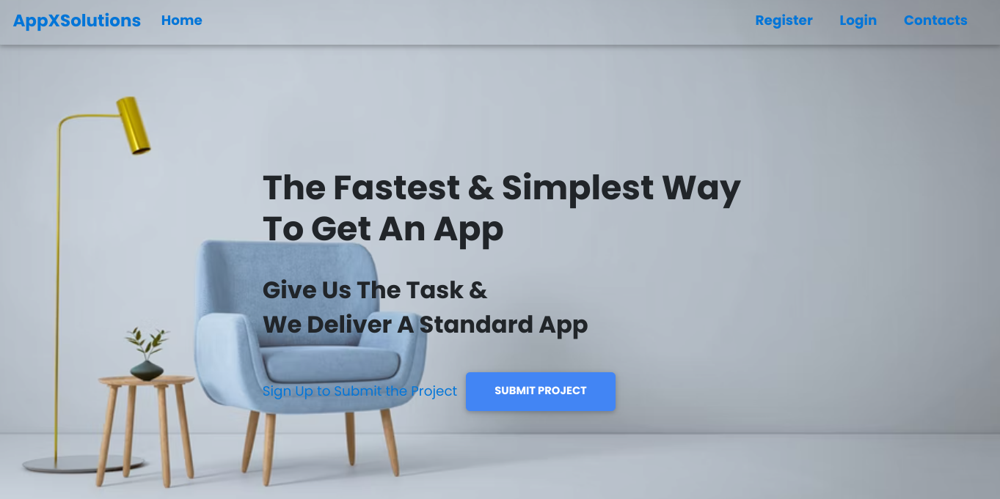
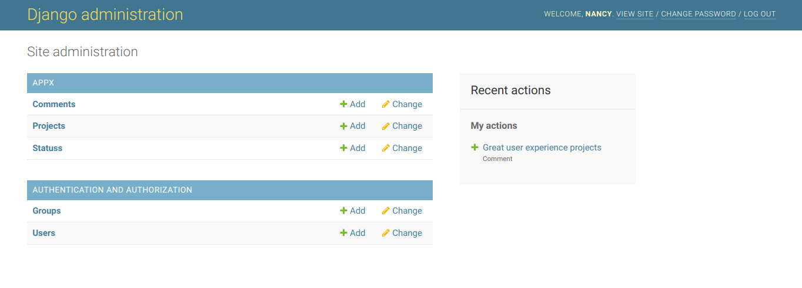
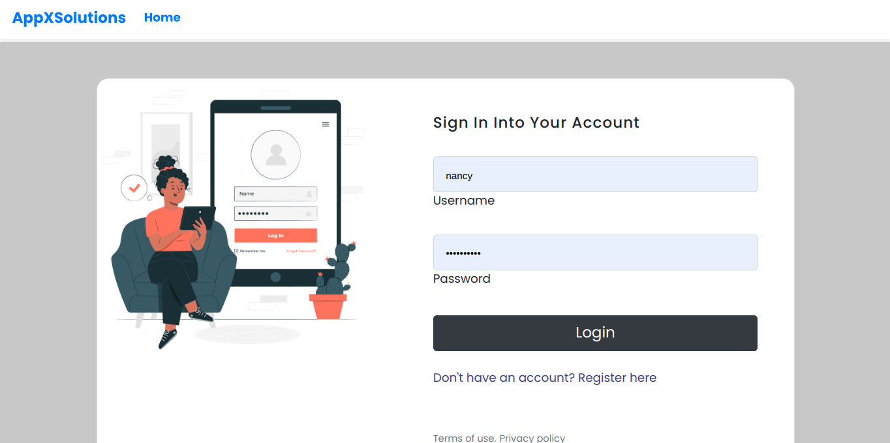
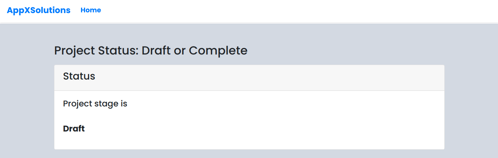

# AppX Solutions

## Description
Django web application that allows users to submit project details that they would like us to develop. Users can also post comments and only logged in users view the project/app status.

## Author
Nazarena Wambura. 
[Github Account](https://github.com/nazarena254)

### Homepage

### Admin panel

### Signup/Login

### Project Status

## Slides/Demo Link
[Slides](https://docs.google.com/presentation/d/1kQBPXVuc_TnvDzG-F7UHBl7B58dP88P6cBEwzRZHA8E/edit)

## User Story
1. User should be able to sign up and login.
2. User can write a comment 
3. Authenticated User can submit project details via form.
4. Authenticated User can view project status.

## Behaviour Driven Development (BDD)
1. Sign up to the application

|Behaviour 	           |    Input 	                 |       Output          |
|----------------------------------------------|:-----------------------------------:|-----------------------------:|       
| Click on sign up  | username,password,email | user account is created  | 

2. log into the application 

|Behaviour 	           |    Input 	                 |       Output          |
|----------------------------------------------|:-----------------------------------:|-----------------------------:|       
| Enter details in the log in form   | username, password| Landing page is loaded   | 

3. Submit project

|Behaviour 	           |    Input 	                 |       Output          |
|----------------------------------------------|:-----------------------------------:|-----------------------------:|       
| Click on button project on the home page | Enter required details| Project is submitted  | 

4. Write a Comment

|Behaviour 	           |    Input 	                 |       Output          |
|----------------------------------------------|:-----------------------------------:|-----------------------------:|       
| Click on comment button   | Write a comment | Submit the comment  |

## Setup/Installation Requirements
1. Create a folder and cd to it.
2. Clone the repository below with the command `git clone <https option url> .`   
    https://github.com/nazarena254/AppX  
3. Install dependencies in the requirements.txt file `pip install -r requirements.txt` .
4.  Type code . or atom . based on the text editor you have and work on it.   

## Database
1. Set up Database(postgresql),and put your username and password in the code
2. Make migrations
    python3 manage.py makemigrations
3. Migrate
   python3 manage.py migrate 
       
## Running the Application
1. Run main aplication locally on http://127.0.0.1:8000/ local host     
   * python3.9 manage.py runserver 
    Note: python version will vary in future

## Creating Admins
1. Creating Admin Locally 
     python manage.py createsuperuser. Then set username, email & password

2. Creating Django Admin   
     heroku run python manage.py createsuperuser. Then set username, email & password

## Technologies Used
* Python3.9.2 - as backend language
* Django4.0.5 - as a Framework
* Bootstrap4 - for responsiveness & styling 
* PostgreSQL - as database
* Heroku - for deploying app

## Support & Contact Information
For any further inquiries, bugs, contributions or comments, reach me at: 
Email:<nancyngunjiri1@gmail.com>  
[Linkedin](https://www.linkedin.com/in/nazarena-wambura/)

## License
[MIT License](https://github.com/nazarena254/AppX/blob/master/LICENSE) 
Copyright (c) 2022 **Nazarena Wambura**

